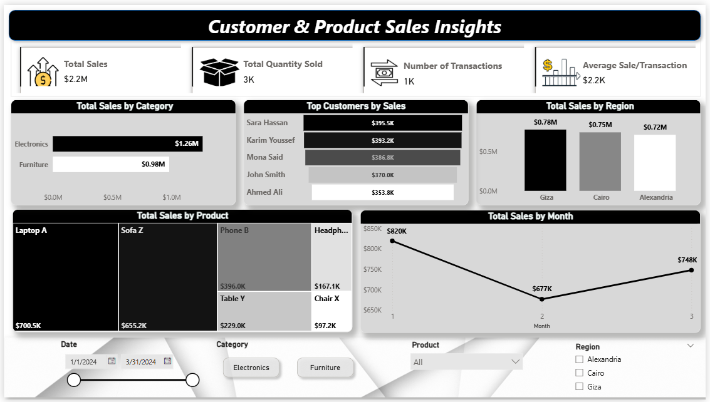

# 📊 Customer & Product Sales Insights Dashboard

_This Power BI dashboard provides a comprehensive view of sales performance across customers, products, categories, and regions. It is designed to help business users quickly identify trends, top performers, and key insights through interactive visuals and tooltips._

#### 🔹 Key Features:

- **KPI Cards:** Display total sales, total quantity sold, number of transactions, and average sale per transaction.
- **Sales by Category:** Comparison of total sales between Electronics and Furniture.
- **Top Customers by Sales:** Highlights the top 5 customers driving revenue.
- **Sales by Region:** Breaks down sales in Cairo, Alexandria, and Giza.
- **Sales by Product:** Treemap visualization to analyze product-level performance.
- **Sales Trend by Month:** Line chart tracking monthly sales performance.
- **Filters & Slicers:** Date range, category, product, and region filters for custom analysis.

#### 🔹 Tooltip Pages:

_The dashboard includes dedicated tooltip report pages for deeper insights:_
- **Region Tooltip:** Shows total sales, quantity, transactions, and average sales by region.
- **Customer Tooltip:** Displays activity details for each customer including sales and transactions.
- **Category Tooltip:** Summarizes sales insights by product category.
- **Month Tooltip:** Extends the line chart by showing KPIs and a pie chart of sales distribution by product for the selected month.

#### 🔹 Purpose:

_This solution enables stakeholders to:_
- Monitor overall business performance at a glance.
- Identify top customers and products contributing to revenue.
- Compare sales performance across regions and categories.
- Track monthly sales trends and detect growth or decline.
- Use tooltips for drill-through insights without cluttering the main dashboard.

#### 📸 Dashboard Preview

